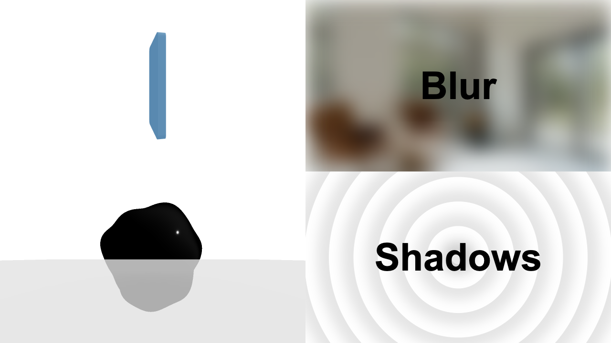

# Remotion GPU Scene

Various 3D scenes, useful for testing if a Remotion render is GPU-accelerated.

## Docs

Get started with Remotion by reading the [fundamentals page](https://www.remotion.dev/docs/the-fundamentals).

## Help

We provide help on our [Discord server](https://discord.gg/6VzzNDwUwV).

## Issues

Found an issue with Remotion? [File an issue here](https://github.com/JonnyBurger/remotion/issues/new).

## License

Note that for some entities a company license is needed. [Read the terms here](https://github.com/remotion-dev/remotion/blob/main/LICENSE.md).

The content of this template is licensed under MIT.
